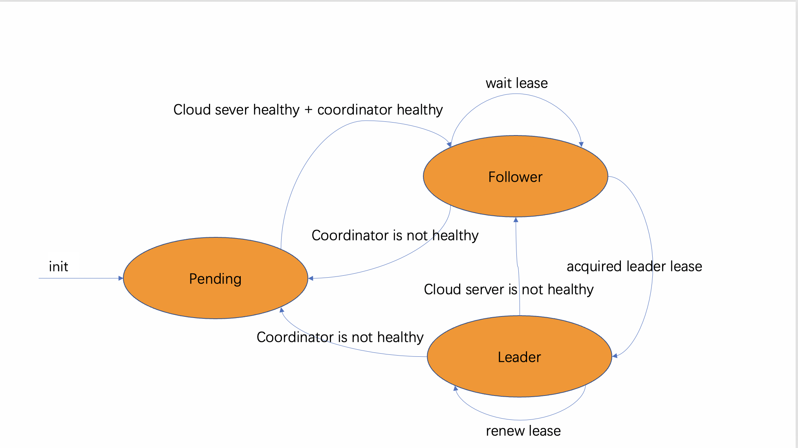

## 1. Introduction

Yurt-Coordinator provides the following features for edge node pools:

1. Edge node heartbeat proxy

In cloud-edge computing scenarios, disconnection between edge nodes and the cloud is the common case. When the cloud does not receive heartbeat from the edge node for a long time, there could be two reasons:

- the cloud-edge network is disconnected but the edge node is still running normally
- or the edge node has failed and cannot recover

In the former case, pods on the edge node are still running normally, and pod eviction should not be performed for the stability. In the latter case, to ensure service availability, pods should be evicted to other healthy edge nodes to continue to provide services. In the original heartbeat framework, it's difficult for the cloud distinguish between them since they look the same. Yurt-Coordinator provides a heartbeat proxy solution, where nodes with healthy cloud-edge network in the node pool are responsible for forwarding disconnected nodes' heartbeat to the cloud with additional information, allowing the cloud to distinguish between these two situations and adopt corresponding strategies.

2. Pool-scope resource caching and reuse

In cloud-edge computing scenarios, the network between the cloud and edge is limited and costly. There is a large amount of duplicated resources that edge nodes in the same node pool obtain from the cloud (such as Endpoints and EndpointSlices),and they are what we called "pool-scope resources". Yurt-Coordinator provides pool-scope resource caching and reuse capabilities in node pool. For these duplicated resources, one node pool only needs to pull them once from the cloud, and other edge nodes in this node pool can directly obtain them from the cache, reducing the consumption of cloud-edge bandwidth.

Yurt-Coordinator is essentially a Pod composed of Kube-APIServer and etcd, fully utilizing cloud-native components to enhance the functionality of node pools.

## 2. Concepts

### 2.1 YurtHub Leader Election

When Yurt-Coordinator is enabled, all YurtHubs in the node pool will perform Leader election through Yurt-Coordinator. The elected Leader YurtHub is responsible for proxying the heartbeat of disconnected nodes. There are three roles for YurtHubs in the cluster:

1. Leader YurtHub: YurtHubs that successfully win the Leader election need to maintain connections with both the cloud APIServer and Yurt-Coordinator.
2. Follower YurtHub: YurtHubs that fail to win the Leader election. These YurtHubs will continuously attempt to acquire the leadership.
3. Pending YurtHub: YurtHubs that have not or can not participate in the election. YurtHubs will be in this state initially, or when the Yurt-Coordinator in the node pool is unhealthy, all YurtHubs in the node pool will enter this state.

## 3. Designs

### 3.1 Edge Node Heartbeat Proxy

In the edge node pool, YurtHubs will send heartbeat(NodeLease) to both the cloud APIServer and Yurt-Coordinator while monitoring the cloud-edge network status. When YurtHub detects the disconnection between cloud and edge, it will add an annotation `openyurt.io/delegate-heartbeat: true` to the heartbeat sent to Yurt-Coordinator, indicating that the node cannot independently send heartbeats to the cloud. At the same time, the Leader Yurthub will list/watch NodeLease resources in Yurt-Coordinator, and when it finds a heartbeat with this annotation, it will forward it along with the annotation to the cloud APIServer. The cloud can then distinguish the status of the edge node based on the heartbeat and its annotation:

1. Node heartbeat is normal and without annotation: The node is running, and the cloud-edge connection is healthy.
2. Node heartbeat is normal but with annotation: The node is running, but the cloud-edge connection is unhealthy.
3. Node heartbeat is missing: The node is faulty.

### 3.2 Node Pool Resource Caching and Reuse

The elected Leader YurtHub in the node pool is responsible for listing/watching pool-scope resources, mainly Endpoints and EndpointSlices, from the cloud. The Leader YurtHub will continuously update these resources and their subsequent changes to the etcd of Yurt-Coordinator. All YurtHubs in the node pool can obtain these resources through Kubernetes native RESTful API from the APIServer of Yurt-Coordinator, avoiding direct pulling from the cloud, thus achieving the goal of resource reuse.

Yurt-Coordinator has two kinds of status:

1. Healthy:

Yurt-Coordinator is successfully deployed and running, and nodes can update their heartbeat to it. However, at this point, Yurt-Coordinator has not fully cached the pool-scope resources, so it cannot handle requests for these resources.

2. Ready:

Yurt-Coordinator has successfully cached the pool-scope resources, and it can now handle requests for these resources within the node pool.

After synchronizing pool-scope resources with the cloud, the Leader YurtHub will create and continuously update a lease called `leader-informer-sync` in Yurt-Coordinator. Other YurtHubs will monitor this lease, and when they find that the lease exists and has not expired, the requests of pool-scope resources will be sent to Yurt-Coordinator instead of the cloud APIServer.

