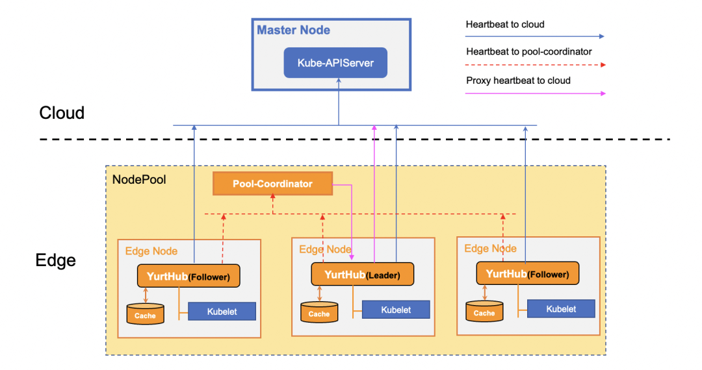
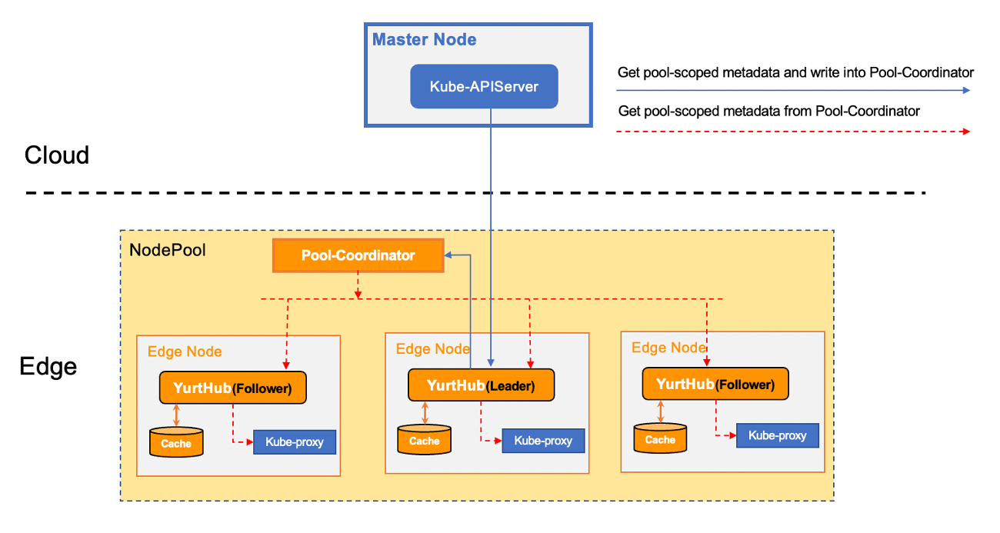

欢迎来到OpenYurt的世界!

**OpenYurt 是业界首个对云原生体系无侵入的边缘计算平台**。从管控端(位于云端或中心机房等)将分散的海量边缘异构资源(如CDN站点，IoT一体机等边缘算力)进行统一管理，
帮助用户轻松完成在海量边缘资源上的大规模应用交付、运维、管控。 OpenYurt具备以下特点：
- Kubernetes无侵入

  云边场景下，用户可以快速且低成本的跟进Kubernetes社区新版本或解决CVE，方便的共享到Kubernetes生态的技术红利。

- 云边端全协同

  通过构建边缘自治，跨地域网络通信，多地域应用编排，应用升级模型，跨平台(如amd64, arm, arm64)的边缘资源纳管，云原生设备管理等能力，使云边端可以高效协同工作，
同时用户可以获得与数据中心Kubernetes集群的一致使用体验。

- 可编程的资源访问控制

  YurtHub组件内置的可编程的数据过滤框架，可以帮助用户对云端请求的返回数据进行无感知，按需的改造，从而满足云边协同场景下的特定业务需求。如服务拓扑的路由选择，
云端访问链路的自适应等。

- 声明式设备管理

  支持松耦合方式集成的IoT设备管理解决方案(如EdgeX Foundry)，同时提供云原生的方式管理端设备，高效地解决物联网边缘计算场景下端设备管理和运维难题。

OpenYurt将持续致力于探索云边端协同的云原生边缘计算平台标准，同时也将结合社区主流计算、网络、存储、应用编排、安全、AI、IoT等项目或方案，构建完整的上下游生态。

## 核心能力
**1. 强大的边缘自治能力**

在 Kubernetes 中，通常如果节点与 apiserver 断开连接，则当节点发生故障时无法恢复正在运行的 Pod。 此外，当节点心跳超过 5m 未上报时，边缘节点上的 Pod 将被 Kube-Controller-Manager 组件的原生控制器驱逐。
由于云边网络可能不可靠，这给云边协同架构带来了巨大挑战。 如下图所示，OpenYurt 引入了一个每节点代理（YurtHub）和本地存储来缓存云 apiserver 状态，因此如果节点断开连接，缓存数据可以被 Kubelet、KubeProxy 或用户 Pod 使用。
并且在Pool-Coordinator组件的帮助下，NodePool中的Leader Yurthub可以被委托帮助NodePool中其他与云端断开连接的边缘节点代理上报心跳，这样边缘节点上的pod即使断网也不会被驱逐。

**2. 跨 NodePool 网络通信能力**

在边缘计算Kubernetes集群中，节点本身可能属于不同的region，因此基于原生的CNI网络方案，位于不同局域网的NodePool中的pod不能通过Pod IP、Service IP、Node IP相互通信。
Raven 是一个优雅的网络解决方案，用于在 OpenYurt 集群中提供跨 NodePool 网络通信能力。 每个节点安装一个节点守护进程，同时每个节点池中只选择一个守护进程作为Gateway，在节点池之间建立VPN隧道，节点池中的其他守护进程配置跨节点池网络路由规则以确保流量通过 Gateway节点。 而且raven只是劫持了跨NodePool的流量，NodePool内部的流量依然采用原生的CNI网络方案。 因此，raven 可以与原生的 CNI 网络解决方案（如 flannel、calico 等）无缝协同工作。 如下图所示，跨节点池流量转发到Gateway节点并通过 VPN 隧道。

**3. 多 NodePool 管理**

为了更好地支持云边协同架构，OpenYurt 首创了管理 Pool 的理念，Pool 封装了对节点资源、应用程序和工作负载流量的管理。 边缘计算资源通常根据其地理分布进行分类并划分为节点池(NodePool)。 为了方便管理多个节点池中的应用程序和流量，为节点池开发了以下几个功能：
- 引入了一组新的工作负载模型，例如 YurtAppSet 和 YurtAppDaemon，用于管理多节点池中的工作负载。
  - YurtAppSet 通过多个工作负载管理多个节点池中的Pod，同时可以指定每个节点池中工作负载的副本数。
  - YurtAppDaemon 用于确保所有（或部分）节点池运行工作负载（Deployment 或 StatefulSet）的副本。 当节点池被添加到集群中时，工作负载会自动添加到新增节点池中。 当节点池从集群中移除时，这些工作负载将被移除。
- 节点池中路由流量的服务拓扑功能。 此功能可以确保 Pod 访问的任何Service的流量仅转发到同一节点池中的Pod实例上，这在跨节点池网络不通或通信费用昂贵的场景下非常有用。

**4. 高级的工作负载升级模型**

在云边架构中，由于云边网络连接不可靠，如果NotReady节点数超过RollingUpdate的maxUnavailable，DaemonSet升级流程很容易阻塞。 在另一种场景下，由于边缘节点可能属于不同的用户（如新能源汽车），最终用户希望节点上的pod不会自动被升级，而是由用户自己决定是否启动节点上的pod升级。 为应对上述挑战，OpenYurt 增强了DaemonSet 升级模型，增加了OTA(On-The-Air) 和Auto Upgrade 模型。
- Auto升级模型：用于解决notReady节点的升级阻塞。 升级过程中，先完成ready节点上的工作负载升级，notReady节点则被跳过。 如果notReady节点状态恢复为就绪，节点上的工作负载升级也将自动完成。
- OTA升级模式：这种模式更加灵活。 如下图所示，用户可以在边缘节点上通过REST API查询是否有新版本的pod。然后用户可以通过边缘节点上的 REST API 触发 pod 升级，这在工作负载升级的决定权属于边缘节点所有者而不是集群所有者时非常有用。 例如：在新能源汽车上的应用升级。

**5. 可编程资源访问控制**

如下图所示，YurtHub组件内置了可编程的数据过滤框架，来自云端的返回数据会经过一个过滤器链，从而对返回数据进行非感知和按需转换，以满足云边协同场景下的特定需求。 过滤器链目前支持四种过滤器如下，同时新的过滤器可以很容易地添加到框架中。
- masterservice：用于改变master service(default/kubernetes)的ClusterIp和https端口，使边缘节点上使用InClusterConfig的pod通过Yurthub组件无感知地访问云端kube-apiserver .
- servicetopology：用于根据服务的服务拓扑设置重新组装endpointslices，以确保访问Service的流量只能转发到同一节点池中的pod。
- discardcloudservice：用于丢弃边缘节点上kube-proxy组件获取Service中LoadBalancer Service，因为无法通过pod IP访问云服务。
- inclusterconfig：用于注释kube-system/kube-proxy configmap中的kubeconfig设置，使kube-proxy组件使用InClusterConfig访问云端kube-apiserver。

**6. 云边网络带宽减少**

[性能测试](https://openyurt.io/docs/test-report/yurthub-performance-test#traffic) 表明，在大规模的 OpenYurt 集群中，如果 pod 频繁删除并重新创建将会产生大量云边通信流量，因为边缘节点上的 kube-proxy 组件会监视所有endpoints/endpointslices变化。 请注意，相同的endpoints/endpointslices数据将被传输到节点池中的每个边缘节点，考虑云边通过公网通信，这可能会给用户带来不小的成本压力。
利用上面提到的pool-coordinator，OpenYurt 建议引入 Pool Scope Data 的概念，这些元数据在节点池中是唯一的，例如endpoints/endpointslices数据。 如下图所示，Leader Yurthub 将从云端 kube-apiserver 读取Pool Scope Data并将更新到pool-coordinator中。 因此，所有其他 YurtHub 将从pool-coordinator中获取 Pool Scope Data，从而消除每个节点使用公共网络带宽从云 kube-apiserver 获取此类数据。

**7. 云原生边缘设备管理**

OpenYurt从云原生视角对边缘终端设备的基本特征（是什么）、主要能力（能做什么）、产生的数据（能够传递什么信息）进行了抽象与定义。 凭借良好的生态兼容性无缝集成了业界知名的IoT设备管理解决方案。最终通过云原生声明式API，向开发者提供设备数据采集处理与管理控制的能力。 如下图所示，在每个节点池中部署了一个 yurt-device-controller 组件实例和 EdgeXFoundry 服务。 Yurt-device-controller组件可以从云端kube-apiserver获取Device CRD的变化，将Device CRD需要的spec转换为EdgeXFoundry的请求，然后将请求实时传输给EdgeXFoundry服务。 另一方面，yurt-device-controller 可以从 EdgeXFoundry 服务订阅设备状态，当状态改变时更新 Device CRD 的状态。

## What's Next
Here are some recommended next steps:
- Start to install [OpenYurt](./installation/summary.md).
- Learn OpenYurt's [Architecture](./core-concepts/architecture.md).
