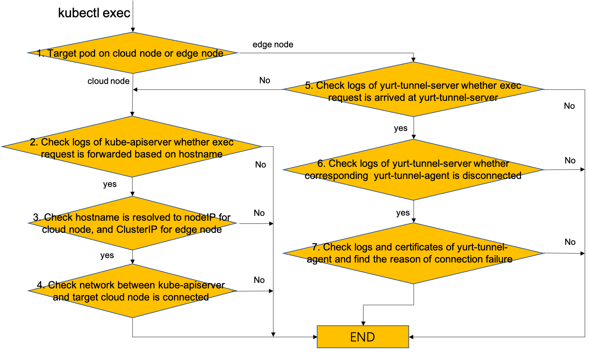

## **yurtadm**

**1. yurtadm join error：crictl not found in system path**

The node does not have docker installed, and installing docker can solve this problem.


**2. yurtadm join error：[ERROR FileExisting-conntrack]: conntrack not found in system path**

Execute `yum install -y conntrack` and then retry the yurtadm join command again.


**3. helm installation error during yurtadm init： Release "yurt-app-manager" does not exist. Installing it now.**
**Error: failed to download "openyurt/yurt-app-manager" (hint: running `helm repo update` may help)**

Perform the helm installation process manually：

```bash
cd /var/lib/sealer/data/my-cluster/rootfs
helm upgrade --install yurt-app-manager openyurt/yurt-app-manager -n kube-system -f manifests/yurt-app-manager-values.yaml
```

**4. yurtadm init failed, how to clean up the environment?**

Since `yurtadm init` uses [sealer](http://sealer.cool/) to create an OpenYurt cluster from scratch, you can refer to [this](http://sealer.cool/zh/help/faq.html#how-to-clean-host-environment-manually-when-sealer-apply-failed) to clean up the environment.


## **yurt-tunnel**

how to troubleshoot the reason when `kubectl exec` command failed to work. please follow the below flow.



- if `exec` request info can't be found in logs of kube-apiserver, please set log level of kube-apiserver to 3(--v=3)
- make sure `kube-apiserver` use `yurt-tunnel-dns` pod to resolve hostname. please reference the tutorial of kube-apiserver adjustment here: https://openyurt.io/docs/installation/openyurt-prepare#3-kube-apiserver-adjustment

There are some issues about yurt-tunnel failure, it might have some help.
**1. kubectl logs edge node error：error: Error from server (ServiceUnavailable): the server is currently unable to handle the request ( pods/log xxx)** 

For more details about this problem, you can refer to [issue 984](https://github.com/openyurtio/openyurt/issues/984).

Please make sure that you are using the latest `yurt-tunnel-server/agent` image (the latest tag of image is confusing, please check the created time).

**2. kubectl logs edge node error：error: You must be logged in to the server (the server has asked for the client to provide credentials ( pods/log xxx))** 

For more details about this problem, you can refer to [issue 984](https://github.com/openyurtio/openyurt/issues/984).

This is most likely to be an issue caused by outdated tunnel server certificate. You can clean up the tunnel server certificate and redeploy yurt-tunnel-server.

```bash
rm -rf /var/lib/yurttunnel-server/pki
kubectl delete pod yurt-tunnel-server-xxxxxx -n kube-system
```

**3. kubectl exec error: unable to upgrade connection: fail to setup the tunnel: fail to setup TLS handshake through the Tunnel**

`kubectl port-forward` may also fail the following similar error.

```bash
root@control-plane:~# kubectl port-forward <...>
error: unable to upgrade connection: fail to setup the tunnel: fail to setup TLS handshake through the Tunnel: write unix @->/tmp/interceptor-proxier.sock: write: broken pipe
```

Fundamentally this problem should be observed because `yurt-tunnel-server/agent` connection cannot be established.

It is likely that this problem may happen since `yurt-tunnel-agent` is not deployed to the corresponding edge nodes.

In that case, it is highly recommended to go through [Setup openyurt components](https://openyurt.io/docs/installation/manually-setup#32-setup-openyurtopenyurt-components) to make sure `yurt-tunnel-server/agent` pods are deployed to appropriate cloud and edge nodes.

If this problem can be observed by requesting `kubectl exec/port-forward` to cloud node which does not require `yurt-tunnel-server/agent` to access the kubelet running on the node, issue may be related to network setting `/etc/hosts`.

If `/etc/hosts` includes any IP addresses with the same hostname registered to Kubernetes / OpenYurt cluster, it might lead the request to be over `yurt-tunnel-server/agent`.

This request will eventually fail with the error message, since there will be no `yurt-tunnel-agent` running on cloud nodes.

In this case, those unrelated IP addresses and hostname would need to be commented out.

For more details, please refer to [issue 1024](https://github.com/openyurtio/openyurt/issues/1024).
